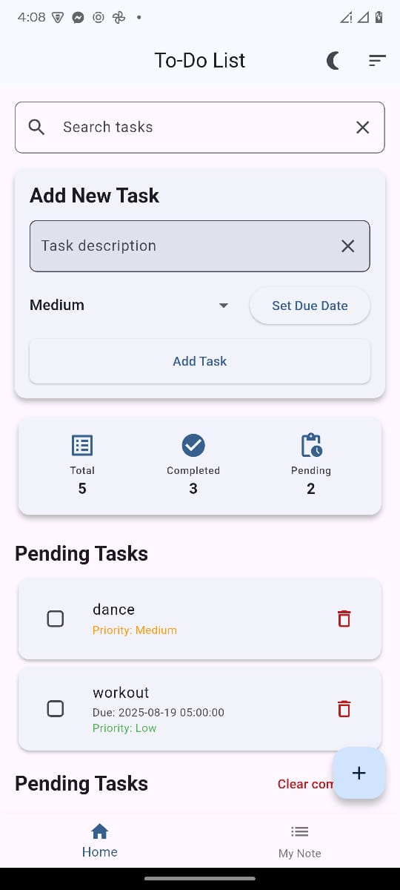
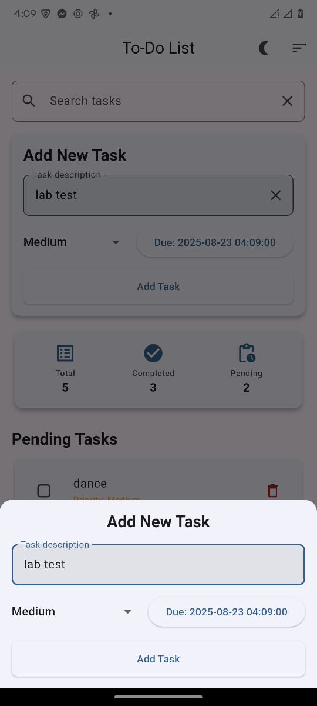
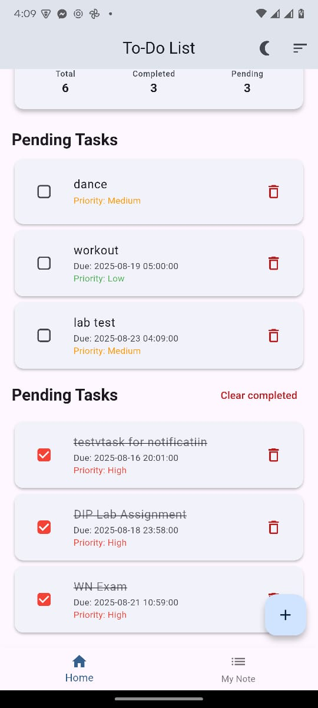
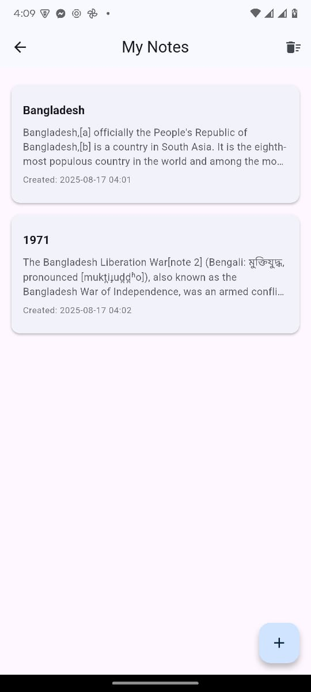

# 📝 To Do & Note

A simple Flutter application to manage your daily **to-do tasks** and **personal notes**.  
This project is built with **Flutter** and serves as a practice project to explore app development.  

---

## 🚀 Getting Started

This project is a starting point for a Flutter application.  

### Prerequisites
Make sure you have the following installed:
- [Flutter SDK](https://docs.flutter.dev/get-started/install)
- [Dart](https://dart.dev/get-dart)
- Android Studio / VS Code with Flutter extensions

### Installation
Clone the repository:
```bash
git clone https://github.com/shahinul22/to_do_and_note.git
cd to_do_and_note
```

Get dependencies:
```bash
flutter pub get
```

Run the app:
```bash
flutter run
```

---

## 📸 Demo

<p align="center">
  
  
  
</p>

<p align="center">
  
  
  
</p>

---

## 🛠️ Features

- Add and manage to-do tasks ✅  
- Write and save personal notes 📝  
- Clean and minimal UI 🎨  

---
